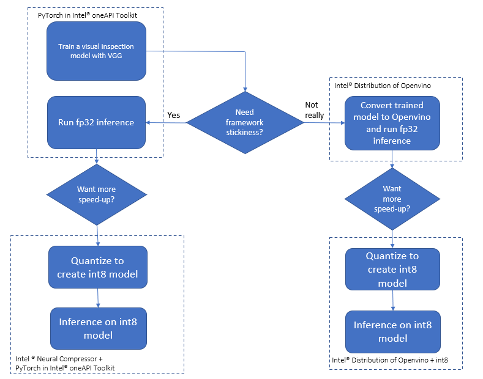
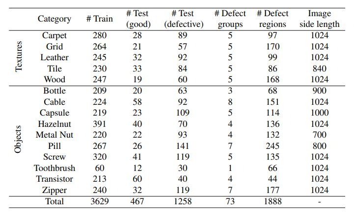
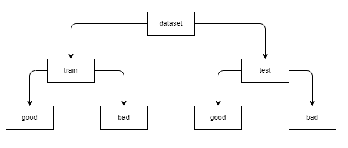

PROJECT NOT UNDER ACTIVE MANAGEMENT

This project will no longer be maintained by Intel.

Intel has ceased development and contributions including, but not limited to, maintenance, bug fixes, new releases, or updates, to this project.  

Intel no longer accepts patches to this project.

If you have an ongoing need to use this project, are interested in independently developing it, or would like to maintain patches for the open source software community, please create your own fork of this project.  

Contact: webadmin@linux.intel.com
# Visual Quality Inspection

## Introduction

The goal of this visual inspection use case is to provide AI-powered quality visual inspection on a dataset for the pharma industry which includes different data augmentations. For this purpose, a computer vision model is built using machine learning tools/libraries in Intel® oneAPI AI Analytics Toolkit. Specifically, Intel® Extension for PyTorch\* is utilized to enhance performance on Intel® hardware.

Check out more workflow examples and reference implementations in the [Developer Catalog](https://developer.intel.com/aireferenceimplementations).

## **Table of Contents**

- [Solution Technical Overview](#solution-technical-overview)
  - [Dataset](#Dataset)
- [Validated Hardware Details](#validated-hardware-details)
- [Software Requirements](#software-requirements)
- [How it Works?](#how-it-works)
- [Get Started](#get-started)
  - [Download the Workflow Repository](#Download-the-Workflow-Repository)
- [Ways to run this reference use case](#Ways-to-run-this-reference-use-case)
  - [Run Using Bare Metal](#run-using-bare-metal)
- [Expected Output](#expected-output)
- [Summary and Next Steps](#summary-and-next-steps)
  - [Adopt to your dataset](#adopt-to-your-dataset)
- [Learn More](#learn-more)
- [Support](#support)
- [Appendix](#appendix)

## Solution Technical Overview

PyTorch* is a machine learning open source framework, and is based on the popular Torch library. PyTorch* is designed to provide good flexibility and high speeds for deep neural network implementation. PyTorch* is different from other deep learning frameworks in that it uses dynamic computation graphs. While static computational graphs (like those used in TensorFlow*) are defined prior to runtime, dynamic graphs are defined "on the fly" via the forward computation. In other words, the graph is rebuilt from scratch on every iteration.

Manual visual Inspection involves analyzing data and identifying anomalies through human observation and intuition. It can be useful in certain scenarios and also has several challenges and limitations. Some difficulties that can be found when performing manual anomaly detection are subjectivity, limited pattern recognition, lack of consistency, time and cost, and detection latency, among others.

The solution contained in this repo uses the following Intel® packages:

> - **Intel® Distribution for Python\***
>
>   The [Intel® Distribution for Python\*](https://www.intel.com/content/www/us/en/developer/tools/oneapi/distribution-for-python.html#gs.52te4z) provides:
>
>   - Scalable performance using all available CPU cores on laptops, desktops, and powerful servers
>   - Support for the latest CPU instructions
>   - Near-native performance through acceleration of core numerical and machine learning packages with libraries like the Intel® oneAPI Math Kernel Library (oneMKL) and Intel® oneAPI Data Analytics Library
>   - Productivity tools for compiling Python code into optimized instructions
>   - Essential Python bindings for easing integration of Intel® native tools with your Python\* project
>
> - **Intel® Extension for Pytorch\***
>
>   The [Intel® Extension for PyTorch\*](https://github.com/intel/intel-extension-for-pytorch/tree/xpu-master):
>
>   - Extends PyTorch\* with up-to-date features optimizations for an extra performance boost on Intel hardware
>   - Optimizations take advantage of AVX-512 Vector Neural Network Instructions (AVX512 VNNI) and Intel® Advanced Matrix Extensions (Intel® AMX) on Intel CPUs as well as Intel Xe Matrix Extensions (XMX) AI engines on Intel discrete GPUs
>   - Through PyTorch* xpu device, Intel® Extension for PyTorch* provides easy GPU acceleration for Intel discrete GPUs with PyTorch\*
>   - Provides optimizations for both eager mode and graph mode
>
> - **Intel® Neural Compressor\***
>
>   The [Intel® Neural Compressor\*](https://github.com/intel/neural-compressor) aims to provide popular model compression techniques such as quantization, pruning (sparsity), distillation, and neural architecture search on mainstream frameworks such as TensorFlow, PyTorch, ONNX Runtime, and MXNet, as well as Intel extensions such as Intel Extension for TensorFlow and Intel Extension for PyTorch.

For more details, visit [Quality Visual Inspection GitHub](https://github.com/oneapi-src/visual-quality-inspection) repository.

## Solution Technical Details



This sample code is implemented for CPU using the Python language and Intel® Extension for PyTorch\* v1.13.120 has been used in this code base. VGGNet, a classical convolutional neural network (CNN) architecture is being used for training. The Visual Geometric Group model (VGG) was developed to increase the depth of such CNNs in order to increase the model performance and it is widely used in computer vision use cases. Tuning parameters has been introduced to the model in an optimization algorithm with different learning rate for checking how quickly the model is adapted to the problem in order to increase the model performance.

### Dataset

[MVTec AD](https://www.mvtec.com/company/research/datasets/mvtec-ad) [[1]](#mvtec_ad_dataset) is a dataset for benchmarking anomaly detection methods with a focus on industrial inspection (follow this [link](#legal_disclaimer) to read the legal disclaimer). It contains over 5000 high-resolution images divided into fifteen different object and texture categories. Each category comprises a set of defect-free training images and a test set of images with various kinds of defects as well as images without defects. We are going to use only the Pill (262 MB) dataset for this use case.

More information can be found on the case study [Explainable Defect Detection Using Convolutional Neural Networks: Case Study](https://towardsdatascience.com/explainable-defect-detection-using-convolutional-neural-networks-case-study-284e57337b59) [[2]](#case_study) and in [VGG16 Model Training](https://github.com/OlgaChernytska/Visual-Inspection) [[3]](#vgg).


<br>
Table 1: Statistical overview of the MVTec AD dataset. For each category, the number of training and test images is given together with additional information about the defects present in the respective test images [[4]](#mvtec_ad).

## Validated Hardware Details

There are workflow-specific hardware and software setup requirements.

| Recommended Hardware                                            | Precision  |
| --------------------------------------------------------------- | ---------- |
| CPU: Intel® 2nd Gen Xeon® Platinum 8280 CPU @ 2.70GHz or higher | FP32, INT8 |
| RAM: 187 GB                                                     |            |
| Recommended Free Disk Space: 20 GB or more                      |            |

Code was tested on Ubuntu\* 22.04 LTS.

## How it Works

This reference use case uses a classical convolutional neural network (CNN) architecture, named VGGNet, implemented for CPU using the Python language and Intel® Extension for PyTorch\*. VGG was developed to increase the depth of such CNNs in order to increase the model performance and it is widely used in computer vision use cases.

The use case can be summarized in three steps:

1. Training
1. Tunning
1. Inference

### 1) Training

VGG-16 is a convolutional neural network that is 16 layers deep and same has been used as classification architecture to classify the good and defect samples from the production pipeline.
Intel® Extension for PyTorch\* is used for transfer learning the VGGNet classification architecture on the pill dataset created.

| **Input Size**          | 224x224   |
| :---------------------- | :-------- |
| **Output Model format** | PyTorch\* |

### 2) Tuning

Created VGGNet classification architecture on the dataset and fine tune the hyper parameters to reach out the maximum accuracy. Introduced different learning rate to the model architecture on the dataset, also we increased the number of epochs to reach maximum accuracy on the training set. Hyperparameters considered for tuning are Learning Rate & Epochs.

_Parameters considered_ `Learning Rate, Epochs, Target training accuracy`

> Created code replication for GridSearchCV to support the code base.

### 3) Inference

Performed inferencing using the trained model with

- Intel® Extension for PyTorch\*
- Intel® Neural Compressor

## Get Started

Define an environment variable that will store the workspace path, this can be an existing directory or one created specifically for this reference use case. You can use the following commands.

[//]: # (capture: baremetal)

```
export WORKSPACE=$PWD/visual-quality-inspection
export DATA_DIR=$WORKSPACE/data
export OUTPUT_DIR=$WORKSPACE/output
```

### Download the Workflow Repository

Create a working directory for the workflow and clone the [Quality Visual Inspection](https://github.com/oneapi-src/visual-quality-inspection) repository into your working directory.

```
mkdir -p $WORKSPACE && cd $WORKSPACE
git clone https://github.com/oneapi-src/visual-quality-inspection.git .
```

### Set up Miniconda

1. Download the appropriate Miniconda Installer for linux.

   ```bash
   wget -q https://repo.anaconda.com/miniconda/Miniconda3-latest-Linux-x86_64.sh
   ```

2. In your terminal, run.

   ```bash
   bash Miniconda3-latest-Linux-x86_64.sh
   ```

3. Delete downloaded file.

   ```bash
   rm Miniconda3-latest-Linux-x86_64.sh
   ```

To learn more about conda installation, see the [Conda Linux installation instructions](https://docs.conda.io/projects/conda/en/stable/user-guide/install/linux.html).

### Set Up Environment
The conda yaml dependencies are kept in `$WORKSPACE/env/intel_env.yml`.

| **Packages required in YAML file:**                 | **Version:**
| :---                          | :--
| `python`  | 3.9
| `intel-aikit-pytorch`  | 2024.0
| `scikit-learn-intelex`  | 2024.0.0
| `seaborn`  | 0.13.0
| `dataset_librarian`  | 1.0.4


Follow the next steps to setup the conda environment:

```sh
conda config --set solver libmamba # If conda<2.10.0 
conda env create -f $WORKSPACE/env/intel_env.yml --no-default-packages
conda activate visual_inspection_intel
```

Environment setup is required only once. This step does not cleanup the existing environment with the same name hence we need to make sure there is no conda environment exists with the same name. During this setup, `visual_inspection_intel` conda environment will be created with the dependencies listed in the YAML configuration.

### Download the Dataset

> The pill dataset is downloaded and extracted in a folder before running the training python module.

Download the mvtec dataset using Intel® AI Reference Models Dataset Librarian (You can get the Dataset from [MVTec AD](https://www.mvtec.com/company/research/datasets/mvtec-ad) [[1]](#mvtec_ad_dataset)). We are going to use the **pill dataset**.

More details of the Intel® AI Reference Models Dataset Librarian can be found [here](https://github.com/IntelAI/models/tree/master/datasets/dataset_api) and, terms and conditions can be found [here](https://github.com/IntelAI/models/blob/master/datasets/dataset_api/src/dataset_librarian/terms_and_conditions.txt).

[//]: # (capture: baremetal)

```sh
python -m dataset_librarian.dataset -n mvtec-ad --download --preprocess -d $DATA_DIR
```

Note: See this dataset's applicable license for terms and conditions. Intel Corporation does not own the rights to this dataset and does not confer any rights to it.

#### Dataset Preparation

The dataset available from the source requires a filtering before the training. Assuming the pill dataset is downloaded with the Intel® AI Reference Models Dataset Librarian or using from the dataset source given above in this document, follow the below steps to filter the dataset extracted from the source.

[//]: # (capture: baremetal)

```sh
mkdir -p $DATA_DIR/{train/{good,bad},test/{good,bad}}

cd $DATA_DIR/pill/train/good/
cp $(ls | head -n 210) $DATA_DIR/train/good/
cp $(ls | tail -n 65) $DATA_DIR/test/good/

cd $DATA_DIR/pill/test/combined
cp $(ls | head -n 17) $DATA_DIR/train/bad/
cp $(ls | tail -n 5) $DATA_DIR/test/bad/
```

**Data Cloning**

> **Note** Data cloning is an optional step

Assuming that pill dataset is downloaded and created the folder structure as mentioned above. Use the below code to clone the data to handle data distribution. Data will be cloned in same directory (e.g. "data")

```
usage: clone_dataset.py [-h] [-d DATAPATH]

optional arguments:
  -h, --help            show this help message and exit
  -d DATAPATH, --datapath DATAPATH
                        dataset path which consists of train and test folders
```

Use the below sample command to perform data cloning

[//]: # (capture: baremetal)

```sh
cd $WORKSPACE/src
python clone_dataset.py -d $DATA_DIR
```

### Supported Runtime Environment

This reference kit offers one options for running the fine-tuning and inference processes:

- [Bare Metal](#run-using-bare-metal)

> **Note**: The performance were tested on Xeon based processors. Some portions of the ref kits may run slower on a client machine, so utilize the flags supported to modify the epochs/batch size to run the training or inference faster.

## Run Using Bare Metal

> **Note**: Follow these instructions to set up and run this workflow on your own development system. 

### Set Up and run Workflow

Below are the steps to reproduce the bechmarking results given in this repository

1. Training VGG16 model
1. Model Inference
1. Quantize trained models using INC and benchmarking

### 1. Training VGG16 model

Run the training module as given below to start training and prediction using the active environment. This module takes option to run the training with and without hyper parameter tuning.

```
usage: training.py [-h] [-d DATAPATH] [-o OUTMODEL] [-a DATAAUG] [-hy HYPERPARAMS]

optional arguments:
  -h, --help            show this help message and exit
  -d DATAPATH, --datapath DATAPATH
                        dataset path which consists of train and test folders
  -o OUTMODEL, --outmodel OUTMODEL
                        outfile name without extension to save the model.
  -a DATAAUG, --dataaug DATAAUG
                        use 1 for enabling data augmentation, default is 0
  -hy HYPERPARAMS, --hyperparams HYPERPARAMS
                        use 1 for enabling hyperparameter tuning, default is 0
```

_You need to change directory to src folder_

[//]: # (capture: baremetal)

```sh
cd $WORKSPACE/src
```

_Command to run training without data augmentation nor hyperparameter tuning_

[//]: # (capture: baremetal)

```sh
python training.py -d $DATA_DIR -o $OUTPUT_DIR/pill_intel_model.h5
```

The model is saved in the OUTPUT_DIR as pill_intel.h5.

_Command to run training with data augmentation_

[//]: # (capture: baremetal)

```sh
python training.py -d  $DATA_DIR -a 1 -o $OUTPUT_DIR/pill_intel_model.h5
```

_Command to run training with hyperparameter tuning_

[//]: # (capture: baremetal)

```sh
python training.py -d $DATA_DIR -hy 1 -o $OUTPUT_DIR/pill_intel_model.h5
```

_Command to run training with data augmentation and hyperparameter tuning_

[//]: # (capture: baremetal)

```sh
python training.py -d $DATA_DIR -a 1 -hy 1 -o $OUTPUT_DIR/pill_intel_model.h5
```

### 2. Inference

#### Running inference using PyTorch\*

Use the following commands to run the inference on test images and get the inference timing for each batch of images.<br>

```
usage: pytorch_evaluation.py [-h] [-d DATA_FOLDER] [-m MODEL_PATH] [-b BATCHSIZE]

optional arguments:
  -h, --help            show this help message and exit
  -d DATA_FOLDER, --data_folder DATA_FOLDER
                        dataset path which consists of train and test folders
  -m MODEL_PATH, --model_path MODEL_PATH
                        Absolute path to the h5 PyTorch* model with extension ".h5"

  -b BATCHSIZE, --batchsize BATCHSIZE
                        use the batchsize that want do inference, default is 1
```

_You need to activate visual_inspection_intel environment and change directory to src folder_

[//]: # (capture: baremetal)

```sh
cd $WORKSPACE/src
```

_Command to run the real-time inference using Intel® PyTorch\*_

```sh
python pytorch_evaluation.py -d $DATA_DIR -m $OUTPUT_DIR/{trained_model.h5} -b 1
```

Using model from previous steps:

[//]: # (capture: baremetal)

```sh
python pytorch_evaluation.py -d $DATA_DIR -m $OUTPUT_DIR/pill_intel_model.h5 -b 1
```

> By using different batchsize one can observe the gain obtained using Intel® Extension for PyTorch\*

### 3. Quantize trained models using Intel® Neural Compressor

Intel® Neural Compressor is used to quantize the FP32 Model to the INT8 Model. Optimized model is used here for evaluating and timing analysis.
Intel® Neural Compressor supports many optimization methods. In this case, we used post training quantization with `Accuracy aware mode` method to quantize the FP32 model.

_Step-1: Conversion of FP32 Model to INT8 Model_

```
usage: neural_compressor_conversion.py [-h] [-d DATAPATH] [-m MODELPATH]
                                       [-c CONFIG] [-o OUTPATH]

optional arguments:
  -h, --help            show this help message and exit
  -d DATAPATH, --datapath DATAPATH
                        dataset path which consists of train and test folders
  -m MODELPATH, --modelpath MODELPATH
                        Model path trained with PyTorch* ".h5" file
  -c CONFIG, --config CONFIG
                        Yaml file for quantizing model, default is
                        "./config.yaml"
  -o OUTPATH, --outpath OUTPATH
                        default output quantized model will be save in
                        ./output folder
```

_Command to run the neural_compressor_conversion_

```sh
cd $WORKSPACE/src/intel_neural_compressor
python neural_compressor_conversion.py -d $DATA_DIR -m $OUTPUT_DIR/{trained_model.h5} -o $OUTPUT_DIR
```

Using model from previous steps:

[//]: # (capture: baremetal)

```sh
cd $WORKSPACE/src/intel_neural_compressor
python neural_compressor_conversion.py -d $DATA_DIR -m $OUTPUT_DIR/pill_intel_model.h5 -o $OUTPUT_DIR
```

> Quantized model will be saved by default in `OUTPUT_DIR` folder

_Step-2: Inferencing using quantized Model_

```
usage: neural_compressor_inference.py [-h] [-d DATAPATH] [-fp32 FP32MODELPATH]
                                      [-c CONFIG] [-int8 INT8MODELPATH]


optional arguments:
  -h, --help            show this help message and exit
  -d DATAPATH, --datapath DATAPATH
                        dataset path which consists of train and test folders
  -fp32 FP32MODELPATH, --fp32modelpath FP32MODELPATH
                        Model path trained with PyTorch* ".h5" file
  -c CONFIG, --config CONFIG
                        Yaml file for quantizing model, default is
                        "./config.yaml"
  -int8 INT8MODELPATH, --int8modelpath INT8MODELPATH
                        load the quantized model folder. default is ./output
                        folder
```

_Command to run neural_compressor_inference for realtime `(batchsize =1)`_

```sh
cd $WORKSPACE/src/intel_neural_compressor
python neural_compressor_inference.py -d $DATA_DIR -fp32 $OUTPUT_DIR/{trained_model.h5}  -int8 $OUTPUT_DIR -b 1
```

Using model from previous steps:

[//]: # (capture: baremetal)

```sh
cd $WORKSPACE/src/intel_neural_compressor
python neural_compressor_inference.py -d $DATA_DIR -fp32 $OUTPUT_DIR/pill_intel_model.h5 -int8 $OUTPUT_DIR -b 1
```

> Use `-b` to test with different batch size (e.g. `-b 10`)

### Clean Up Bare Metal

Follow these steps to restore your `$WORKSPACE` directory to an initial step. Please note that all downloaded dataset files, conda environment, and logs created by workflow will be deleted. Before executing next steps back up your important files.

[//]: # (capture: baremetal)

```bash
conda deactivate
conda env remove -n visual_inspection_intel
rm -rf $DATA_DIR/*
rm -rf $OUTPUT_DIR/*
```

Remove repository

[//]: # (capture: baremetal)

```sh
rm -rf $WORKSPACE
```

## Expected Outputs

### Expected Output for training without data augmentation and hyperparameter tuning

Below output would be generated by the training module which will capture the overall training time.

```
Dataset path Found!!
Train and Test Data folders Found!
Dataset data/: N Images = 694, Share of anomalies = 0.218
Epoch 1/10: Loss = 0.6575, Accuracy = 0.7236
Epoch 2/10: Loss = 0.4175, Accuracy = 0.8455
Epoch 3/10: Loss = 0.3731, Accuracy = 0.8691
Epoch 4/10: Loss = 0.2419, Accuracy = 0.9273
Epoch 5/10: Loss = 0.0951, Accuracy = 0.9745
Epoch 6/10: Loss = 0.0796, Accuracy = 0.9709
Epoch 7/10: Loss = 0.0696, Accuracy = 0.9764
Epoch 8/10: Loss = 0.0977, Accuracy = 0.9727
Epoch 9/10: Loss = 0.0957, Accuracy = 0.9727
Epoch 10/10: Loss = 0.1580, Accuracy = 0.9600
train_time= 1094.215266942978
```

**Capturing the time for training and inferencing**
The line containing `train_time` gives the time required for the training the model.
Run this script to record multiple trials and the average can be calculated.

### Expected Output for Inferencing using quantized Model

Below output would be generated by the Inferencing using quantized Model with neural compressor.

```
Batch Size used here is  1
Average Inference Time Taken Fp32 -->  0.035616397857666016
Average Inference Time Taken Int8 -->  0.011458873748779297
**************************************************
Evaluating the Quantizaed Model
**************************************************
2023-07-04 05:59:42 [WARNING] Force convert framework model to neural_compressor model.
2023-07-04 05:59:42 [INFO] Start to run Benchmark.
2023-07-04 05:59:49 [INFO]
accuracy mode benchmark result:
2023-07-04 05:59:49 [INFO] Batch size = 1
2023-07-04 05:59:49 [INFO] Accuracy is 0.9595
**************************************************
Evaluating the FP32 Model
**************************************************
2023-07-04 05:59:49 [WARNING] Force convert framework model to neural_compressor model.
2023-07-04 05:59:49 [INFO] Start to run Benchmark.
2023-07-04 05:59:59 [INFO]
accuracy mode benchmark result:
2023-07-04 05:59:59 [INFO] Batch size = 1
2023-07-04 05:59:59 [INFO] Accuracy is 0.9595
```

## Summary and Next Steps

Intel® Extension for PyTorch\* v2.0.110

- The reference use case above demonstrates an Anomaly Detection approach using a convolutional neural network. For optimal performance on Intel architecture, the scripts are also enabled with Intel extension for PyTorch\*, Intel extension for scikit-learn and Intel® Neural Compressor.

#### Adopt to your dataset

This reference use case can be easily deployed on a different or customized dataset by simply arranging the images for training and testing in the following folder structure (Note: this approach only uses good images for training):



#### Conclusion

With the arrival of computer vision (CV) techniques, powered by Artificial Intelligence (AI) and deep learning, visual inspection has been digitalized and automated. Factories have installed cameras in each production line and huge quantities of images are read and processed using a deep learning model trained for defect detection. If each production line will have its CV application running on the edge to train that can show the scale of the challenge this industry faces with automation. CV applications demand, however, huge amounts of processing power to process the increasing image load, requiring a trade-off between accuracy, inference performance, and compute cost. Manufacturers will look for easy and cost-effective ways to deploy computer vision applications across edge-cloud infrastructures to balance the cost without impacting accuracy and inference performance. This reference kit implementation provides performance-optimized guide around quality visual inspection use cases that can be easily scaled across similar use cases.

## Learn More

For more information about <workflow> or to read about other relevant workflow
examples, see these guides and software resources:

- [Intel® AI Analytics Toolkit (AI Kit)](https://www.intel.com/content/www/us/en/developer/tools/oneapi/ai-analytics-toolkit.html)
- [Developer Catalog](https://developer.intel.com/aireferenceimplementations)
- [Intel® Distribution for Python\*](https://www.intel.com/content/www/us/en/developer/tools/oneapi/distribution-for-python.html#gs.52te4z)
- [Intel® Extension for PyTorch\*](https://github.com/intel/intel-extension-for-pytorch)
- [Intel® Neural Compressor\*](https://github.com/intel/neural-compressor)

## Support

If you have any questions with this workflow, want help with troubleshooting, want to report a bug or submit enhancement requests, please submit a GitHub issue.

## Appendix

### References

<a id="mvtec_ad_dataset">[1]</a> GmbH, M. (2023). MVTec Anomaly Detection Dataset: MVTec Software. Retrieved 5 September 2023, from https://www.mvtec.com/company/research/datasets/mvtec-ad

<a id="case_study">[2]</a> Explainable Defect Detection Using Convolutional Neural Networks: Case Study. (2022). Retrieved 5 September 2023, from https://towardsdatascience.com/explainable-defect-detection-using-convolutional-neural-networks-case-study-284e57337b59

<a id="vgg">[3]</a> GitHub - OlgaChernytska/Visual-Inspection: Explainable Defect Detection using Convolutional Neural Networks: Case Study. (2023). Retrieved 5 September 2023, from https://github.com/OlgaChernytska/Visual-Inspection

<a id="mvtec_ad">[4]</a> Bergmann, P., Fauser, M., Sattlegger, D., & Steger, C. (2019). [MVTec AD--A comprehensive real-world dataset for unsupervised anomaly detection](https://www.mvtec.com/fileadmin/Redaktion/mvtec.com/company/research/datasets/mvtec_ad.pdf). In Proceedings of the IEEE/CVF conference on computer vision and pattern recognition (pp. 9592-9600).


### Notices & Disclaimers

<a id="legal_disclaimer"></a>

To the extent that any public or non-Intel datasets or models are referenced by or accessed using tools or code on this site those datasets or models are provided by the third party indicated as the content source. Intel does not create the content and does not warrant its accuracy or quality. By accessing the public content, or using materials trained on or with such content, you agree to the terms associated with that content and that your use complies with the applicable license.

Intel expressly disclaims the accuracy, adequacy, or completeness of any such public content, and is not liable for any errors, omissions, or defects in the content, or for any reliance on the content. Intel is not liable for any liability or damages relating to your use of public content.

Please see this data set's applicable license for terms and conditions. Intel®Corporation does not own the rights to this data set and does not confer any rights to it.

\*Other names and brands that may be claimed as the property of others. [Trademarks](https://www.intel.com/content/www/us/en/legal/trademarks.html).

Performance varies by use, configuration, and other factors. Learn more on the [Performance Index site](https://edc.intel.com/content/www/us/en/products/performance/benchmarks/overview/).

Performance results are based on testing as of dates shown in configurations and may not reflect all publicly available updates. See backup for configuration details. No product or component can be absolutely secure.
Your costs and results may vary.

Intel technologies may require enabled hardware, software, or service activation.

© Intel Corporation. Intel, the Intel logo, and other Intel marks are trademarks of Intel Corporation or its subsidiaries. Other names and brands may be claimed as the property of others.
